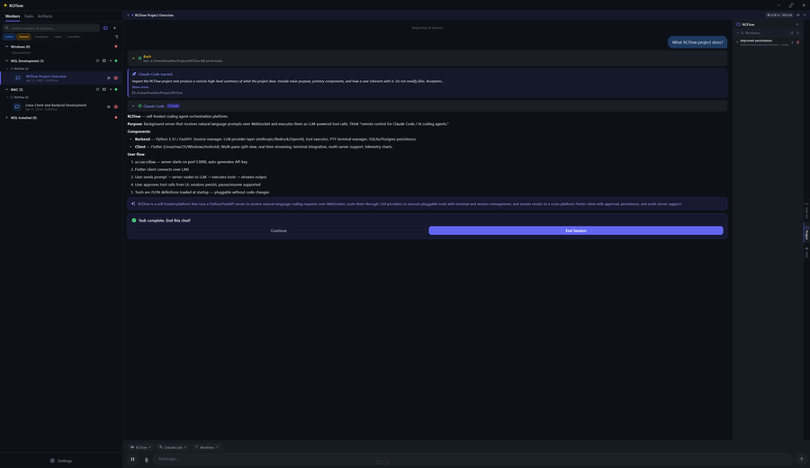

# RCFlow

[](LICENSE)
[](https://www.python.org/)
[](rcflowclient/)
[](https://github.com/Flowelfox/RCFlow/actions/workflows/ci.yml)

A self-hosted coding agent orchestration platform. Run a lightweight backend server on your development machine and control it from the companion Flutter app — on desktop, Android, or any other device on your network. Spin up Claude Code, OpenAI Codex, or OpenCode agents across multiple projects and git worktrees simultaneously, stream output in real time, and approve tool calls from anywhere.



---

## Key Features

- **Agent orchestration** — Run Claude Code, Codex, and OpenCode agents concurrently across different projects and worktrees
- **Remote control** — Drive agents over WebSocket from any device on your network; the server runs on your machine, the client connects from anywhere
- **Real-time streaming** — Dedicated WebSocket channels for input and output; output streams token by token as agents work
- **Built-in Flutter client** — Desktop (Linux, macOS, Windows) and Android app with split-pane layout, markdown rendering, terminal emulation, and tool-call approval UI
- **Integrated terminal** — Full PTY sessions over WebSocket with xterm rendering in the client
- **Session management** — Persistent sessions with pause, resume, restore, and history; automatically archived to SQLite or PostgreSQL
- **Pluggable tools** — Tools are JSON files loaded at startup; extend agent capabilities without touching source code
- **Multi-backend LLM** — Anthropic API, AWS Bedrock, or any OpenAI-compatible provider
- **Live config** — Change LLM provider, API keys, and settings at runtime via the REST API — no restart required

---

## Requirements

- **Python 3.12+**
- **[uv](https://docs.astral.sh/uv/)** — Python package manager
- An API key for at least one LLM provider: **Anthropic**, **OpenAI**, or **AWS Bedrock**

For the Flutter client, pre-built binaries are available on the [Releases](../../releases) page. To build from source, [Flutter SDK](https://flutter.dev/docs/get-started/install) is required.

---

## Installation

### Quick Install (Linux / macOS)

Install the latest backend server (worker) with a single command:

```bash
curl -fsSL https://rcflow.app/get-worker.sh | sh
```

Install the desktop client:

```bash
curl -fsSL https://rcflow.app/get-client.sh | sh
```

Pin a specific version with `RCFLOW_VERSION`:

```bash
curl -fsSL https://rcflow.app/get-worker.sh | RCFLOW_VERSION=0.35.0 sh
```

Pass installer options (port, install directory):

```bash
curl -fsSL https://rcflow.app/get-worker.sh | sh -s -- --port 8080 --prefix /opt/rcflow
```

### From a Release (manual)

Download a release archive from the [Releases](../../releases) page and run the bundled installer:

```bash
# Linux
tar -xf rcflow-v*-linux-worker-amd64.tar.gz
cd rcflow-v*-linux-worker-amd64
sudo ./install.sh
```

Pre-built client packages — Android APK, Windows installer, macOS DMG, Linux `.deb` — are attached to each release.

### Development Setup

```bash
git clone https://github.com/Flowelfox/RCFlow.git
cd RCFlow
uv sync --dev       # Install all dependencies including dev tools
uv run rcflow       # Start the server
```

On first run, `settings.json` is written automatically with default values and a freshly generated API key. The server binds to `0.0.0.0:53890` by default.

Run `just` with no arguments to list all available development targets (requires [just](https://github.com/casey/just)):

```
just dev            # Install deps + set up pre-commit hooks
just run            # Start the server
just lint           # Run ruff linter
just format         # Auto-format with ruff
just typecheck      # Run ty type checker
just test           # Run full test suite (Python + Flutter)
just coverage       # Python tests with coverage report
just migrate        # Apply pending database migrations
```

---

## Configuration

Settings are read from `settings.json` in the server directory. Edit the file directly or use the `PATCH /api/config` endpoint to update values at runtime without restarting. Environment variables override `settings.json`.

| Setting | Description | Default |
|---|---|---|
| `RCFLOW_HOST` | Bind address | `0.0.0.0` |
| `RCFLOW_PORT` | Server port | `53890` |
| `RCFLOW_API_KEY` | Authentication key for clients | *(auto-generated)* |
| `LLM_PROVIDER` | `anthropic`, `bedrock`, `openai`, or `none` | `anthropic` |
| `ANTHROPIC_API_KEY` | Anthropic API key | |
| `ANTHROPIC_MODEL` | Model identifier | `claude-sonnet-4-6` |
| `OPENAI_API_KEY` | OpenAI API key | |
| `DATABASE_URL` | SQLAlchemy async URL | `sqlite+aiosqlite:///./data/rcflow.db` |
| `SSL_CERTFILE` / `SSL_KEYFILE` | TLS certificate paths (enables WSS) | |
| `STT_PROVIDER` | Speech-to-text provider | `wispr_flow` |
| `PROJECTS_DIR` | Root directory scanned for projects | `~/Projects` |
| `TOOLS_DIR` | Directory containing tool JSON definitions | `./tools` |
| `LOG_LEVEL` | Logging verbosity | `INFO` |

For the full configuration reference (AWS Bedrock, TTS, Codex, worker settings, etc.) see `Design.md`.

---

## API

OpenAPI docs (Swagger UI) are served at `http://localhost:53890/docs` while the server is running.

### REST Endpoints (`/api`)

All endpoints except `/api/health` require the `RCFLOW_API_KEY` header or `api_key` query parameter.

| Method | Path | Description |
|---|---|---|
| `GET` | `/api/health` | Health check (unauthenticated) |
| `GET` | `/api/info` | Server OS and platform info |
| `GET` | `/api/config` | Read current configuration |
| `PATCH` | `/api/config` | Update configuration at runtime |
| `GET` | `/api/sessions` | List all sessions |
| `GET` | `/api/sessions/{id}/messages` | Session message history (paginated) |
| `POST` | `/api/sessions/{id}/cancel` | Cancel a running session |
| `POST` | `/api/sessions/{id}/end` | End a session |
| `POST` | `/api/sessions/{id}/pause` | Pause a session |
| `POST` | `/api/sessions/{id}/resume` | Resume a paused session |
| `POST` | `/api/sessions/{id}/restore` | Restore an archived session |
| `PATCH` | `/api/sessions/{id}/title` | Rename a session |
| `GET` | `/api/tools` | List available tool definitions |
| `GET` | `/api/tools/status` | Managed tool installation status |
| `POST` | `/api/tools/update` | Trigger tool updates |
| `DELETE` | `/api/tools/{id}` | Remove a tool definition |
| `GET` | `/api/projects` | List project directories |
| `GET` | `/api/projects/{name}/worktrees` | List git worktrees for a project |
| `GET` | `/api/projects/{name}/artifacts` | List code artifacts for a project |
| `GET` | `/api/tasks` | List tasks |
| `POST` | `/api/tasks` | Create a task |
| `PATCH` | `/api/tasks/{id}` | Update a task |
| `DELETE` | `/api/tasks/{id}` | Delete a task |
| `GET` | `/api/telemetry/sessions` | Session telemetry summary |
| `GET` | `/api/telemetry/timeseries` | Time-series usage data |
| `POST` | `/api/uploads` | Upload an attachment |

### WebSocket Endpoints

| Path | Direction | Description |
|---|---|---|
| `/ws/input/text` | Client → Server | Send prompts, attachments, and tool-call approvals |
| `/ws/output/text` | Server → Client | Streaming text output, tool-call events, and session state |
| `/ws/terminal` | Bidirectional | Full PTY session (terminal I/O and control messages) |

---

## Tools

Tools are JSON definition files in the `tools/` directory. Each file specifies a name, description, parameters (JSON Schema), executor type, and configuration. The server loads them at startup and makes them available to LLM agents.

| Tool | Executor | Description |
|---|---|---|
| `shell_exec` | `shell` | Execute shell commands on the host |
| `system_info` | `shell` | Gather system information |
| `claude_code` | `claude_code` | Interactive Claude Code agent sessions |
| `codex` | `codex` | OpenAI Codex agent sessions |
| `opencode` | `opencode` | OpenCode agent sessions |

Add your own tools by dropping a JSON file into the `tools/` directory — no code changes required.

---

## Architecture

```
  ┌─────────────────────────────────────────────────────┐
  │              Desktop / Mobile Client                 │
  │         (Flutter — Linux, macOS, Windows, Android)  │
  └────────────┬──────────────┬──────────────┬──────────┘
               │              │              │
    prompts &  │   streaming  │   terminal   │  REST
    approvals  │   output     │   I/O (PTY)  │  /api/*
               │              │              │
               ▼              ▼              ▼
        /ws/input/text  /ws/output/text  /ws/terminal
  ──────────────────────────────────────────────────────
               │                            ▲
               ▼                            │
        Prompt Router                       │
               │                            │
               ▼                            │
        Session Manager ◄───────────────────┤
               │                            │
               ▼                            │
         LLM Provider                       │
    (Anthropic · Bedrock · OpenAI)          │
               │                            │
               │  tool calls                │
               ▼                            │
        Tool Executor ──────────────────────┘
        ┌──────┴────────────────────┐
        │                           │
        ▼                           ▼
  Shell / System            Coding Agents
   commands                (Claude Code · Codex
                              · OpenCode)
               │
               ▼
          Database
    (SQLite / PostgreSQL)
```

**Request lifecycle:**

| Step | What happens |
|---|---|
| 1 | Client sends a prompt over `/ws/input/text` |
| 2 | Prompt Router creates or resumes a Session |
| 3 | LLM streams a response, emitting tool calls as needed |
| 4 | Tool Executor dispatches each call (shell, coding agent, etc.) |
| 5 | Tool results feed back into the LLM; loop repeats until done |
| 6 | Output streams to the client in real time over `/ws/output/text` |
| 7 | Completed session is archived to the database |

---

## Contributing

Contributions are welcome. Before opening a pull request:

1. Read `Design.md` — it is the source of truth for architecture, conventions, and design decisions.
2. Run `just check` to verify linting, formatting, and type checking pass.
3. Run `just test` to ensure all tests pass.
4. If your change modifies the architecture, adds endpoints, changes data models, or alters documented behavior, update `Design.md` as part of the same PR.

---

## License

GNU Affero General Public License v3 — see [LICENSE](LICENSE).
